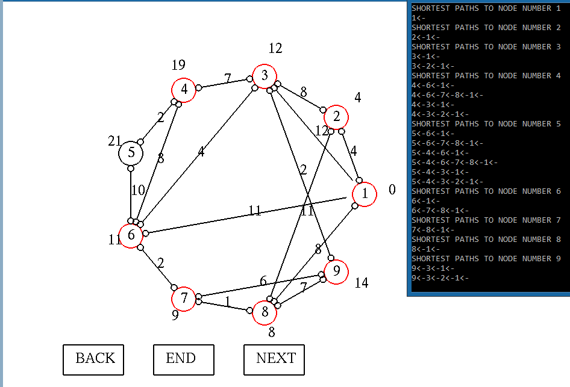

# DikstraVisualization
Dijkstra Visualization Algorithm (c++ and glut)
# Example
int V = 9; 
int graph[9][9] =
{ { 0, 4, 12, 0, 0, 11, 0, 8, 0 }, 
{ 4, 0, 8, 0, 0, 0, 0, 11, 0 }, 
{ 0, 8, 0, 7, 0, 4, 0, 0, 2 }, 
{ 0, 0, 7, 0, 2, 8, 0, 0, 0 }, 
{ 0, 0, 0, 2, 0, 10, 0, 0, 0 }, 
{ 0, 0, 4, 8, 10, 0, 2, 0, 0 }, 
{ 0, 0, 0, 0, 0, 2, 0, 1, 6 }, 
{ 8, 11, 0, 0, 0, 0, 1, 0, 7 }, 
{ 0, 0, 2, 0, 0, 0, 6, 7, 0 } 
};

